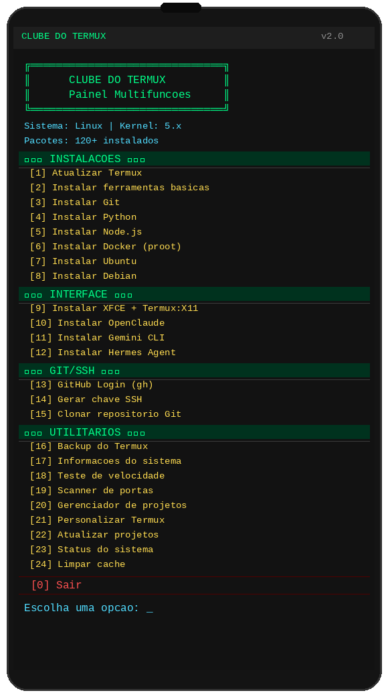

# CLUBE DO TERMUX



Painel multifunções para Termux com 24 opções automatizadas.

## 📦 Instalação

```bash
curl -fsSL https://raw.githubusercontent.com/carlos46743/clube-do-termux/master/termux-panel.sh -o termux-panel.sh
bash termux-panel.sh
```

## 🚀 Funcionalidades

### INSTALAÇÕES
| Opção | Função |
|-------|--------|
| [1] | Atualizar Termux |
| [2] | Instalar ferramentas básicas |
| [3] | Instalar Git |
| [4] | Instalar Python |
| [5] | Instalar Node.js |
| [6] | Instalar Docker (proot) |
| [7] | Instalar Ubuntu |
| [8] | Instalar Debian |

### INTERFACE
| Opção | Função |
|-------|--------|
| [9] | Instalar XFCE + Termux:X11 |
| [10] | Instalar OpenClaude |
| [11] | Instalar Gemini CLI |
| [12] | Instalar Hermes Agent |

### GIT/SSH
| Opção | Função |
|-------|--------|
| [13] | GitHub Login (gh) |
| [14] | Gerar chave SSH |
| [15] | Clonar repositório Git |

### UTILITÁRIOS
| Opção | Função |
|-------|--------|
| [16] | Backup do Termux |
| [17] | Informações do sistema |
| [18] | Teste de velocidade da internet |
| [19] | Scanner de portas da rede local |
| [20] | Gerenciador de projetos |
| [21] | Personalizar Termux |
| [22] | Atualizar todos os projetos |
| [23] | Status do sistema |
| [24] | Limpar cache |
| [0] | Sair |

## 📸 Preview do painel


## 🔧 Requisitos

- Termux instalado no Android
- Conexão com internet
- Mínimo 2GB de espaço livre (para instalações completas)

## 🌐 Acesse também

- **Site:** [clube-do-termux](https://carlos46743.github.io/clube-do-termux)
- **GitHub:** [github.com/carlos46743/clube-do-termux](https://github.com/carlos46743/clube-do-termux)

## 📄 Licença

Este projeto está sob a licença MIT.
